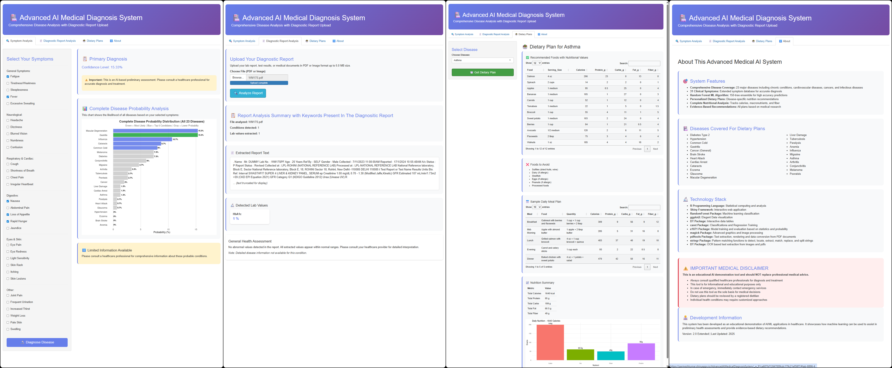

# 🏥 Advanced AI-Based Disease Diagnosis & Dietary Recommendation System

An AI-powered healthcare decision-support system built using **R & Shiny** that performs **symptom-based disease prediction**, **diagnostic report analysis**, and **personalized dietary recommendations** for multiple acute and chronic diseases.

> ⚠️ **Disclaimer:** This project is for **educational and research purposes only** and must **NOT** be used as a substitute for professional medical diagnosis or treatment.

---
## 🚀 Live Dashboard Preview

👉 **Access the live Shiny app here:**  
🔗 https://parmeshkumar.shinyapps.io/AdvancedAIMedicalDiagnosisSystem/

---

## 📊 Dashboard Preview

### Advanced AI Medical Diagnosis System Module

---

## 🚀 Key Features

### 🔍 Symptom-Based Disease Diagnosis
- Predicts **23 major diseases** using **31 clinical symptoms**
- Machine Learning model: **Random Forest (150 trees)**
- Outputs:
  - Primary disease prediction
  - Confidence score
  - Full probability distribution across all diseases
  - Detailed disease information (symptoms, causes, treatment)

### 📄 Diagnostic Report Analysis (PDF / Image)
- Upload **PDF or image-based medical reports up to 5 MB size**
- OCR-based text extraction
- Automatically detects abnormal lab values such as:
  - Blood Glucose, HbA1c
  - Liver enzymes (ALT, AST, Bilirubin)
  - Cardiac markers (Troponin, Cholesterol, LDL)
  - Hemoglobin, Blood Pressure
- Maps detected abnormalities to relevant diseases

### 🥗 Disease-Specific Dietary Recommendations
- Nutrition plans for **23 diseases**
- Includes:
  - Foods to eat with nutrition values
  - Foods to avoid
  - Sample daily meal plan
  - Total calories, protein, carbs, fat, and fiber
- Visual nutrition summaries

### 📊 Interactive Shiny Dashboard
- Clean medical-grade UI
- Interactive tables and plots
- User-friendly navigation across modules

---

## 🧠 Symptom Analysis based on Selected Symptoms

31 symptoms have been considered for the disease analysis
|General Symptoms|Neurological|Respiratory & Cardiac|Digestive|Eyes & Skin|Other|
|---|---|---|---|---|---|
| Fatigue | Headache | Cough | Nausea | Eye Pain | Joint Pain |
| Tiredness/Weakness | Dizziness | Shortness of Breath | Abdominal Pain | Eye Redness | Frequent Urination |
| Sleeplessness | Blurred Vision | Chest Pain | Loss of Appetite | Light Sensitivity | Increased Thirst |
| Fever | Numbness | Irregular Heartbeat | Rapid hunger | Skin Rash | Weight Loss |
| Excessive Sweating | Confusion |  | Jaundice | Itching | Pale Skin |
|  |  |  |  | Skin Lesions | Swelling |

---

## 🧠 Diseases Covered for Dietary Plans

23 diseases have been taken for the dietary recommendation
| | | | |
|---|---|---|---|
| Diabetes | Hypertension | Common Cold | Influenza |
| Gastritis | Migraine | Asthma | Arthritis |
| Cancer | Brain Stroke | Cardiac Arrest | Heart Attack |
| Liver Damage | Tuberculosis | Paralysis | Anemia |
| Cataracts | Glaucoma | Macular Degeneration | Conjunctivitis |
| Eczema | Psoriasis | Melanoma |  |

---

## 🛠 Technology Stack

- **Language:** R  
- **Web Framework:** Shiny  
- **Machine Learning:** randomForest, caret, e1071  
- **Visualization:** ggplot2, DT  
- **OCR & PDF Processing:** tesseract, pdftools, magick  
- **Text Processing:** stringr  

---

## 📂 Project Structure

- **Advaned-AI-Medical-Diagnosis-System-Shiny-App/**
  - **app.R** – Complete Shiny application  
  - **README.md** – Project documentation  
  - **data/** – A sample Diagnostic report  
  - **LICENSE** – Open-source license  

---

## ⚙️ Installation & Setup

### 1️⃣ Clone the Repository

git clone https://github.com/parmesh-kumar-ai/AI-Medical-Diagnosis-Shiny-App.git
cd AI-Medical-Diagnosis-Shiny-App

---

## 2️⃣ Install Required R Packages
install.packages(c(
  "shiny", "caret", "randomForest", "e1071",
  "DT", "ggplot2", "pdftools",
  "tesseract", "magick", "stringr"
))

⚠️ Note:
Ensure Tesseract OCR Engine is installed on your system for report analysis.

---
## 3️⃣ Run the Application

shiny::runApp("app.R")

The dashboard will launch in your default web browser.

---

## 🧪 Machine Learning Details

- **Algorithm:** Random Forest Classifier  
- **Number of Trees:** 150  
- **Input:** Binary symptom matrix (31 symptoms)  
- **Output:** Disease probability distribution (23 diseases)  
- **Feature Importance:** Enabled  

---

## ⚠️ Medical Disclaimer

- This system is **NOT** a medical device  
- Always consult a **qualified healthcare professional**  
- Do **NOT** use for emergency situations  
- Dietary plans should be reviewed by a **registered dietitian**  

---

## 🎯 Use Cases

- Healthcare AI learning projects  
- Academic research demonstrations  
- Data Science & ML portfolios  
- Shiny dashboard reference architecture  
- Nutrition & disease analytics  

---

## 🔮 Future Enhancements

- Deep Learning models (XGBoost, Neural Networks)  
- Patient history tracking  
- API deployment using Plumber  
- Mobile-responsive UI  
- Clinical validation benchmarking  
- Cloud deployment (Shiny Server / AWS)  

---

## 👨‍💻 Author

- **Developed by:** Parmesh Kumar  
- **Domain:** AI, Machine Learning, Healthcare Analytics  
- **Purpose:** Educational & Research Demonstration

📄 Read more about the author here:  
👉 [Author.md](Author.md)

---

## 📜 License

This project is licensed under the **MIT License**.

